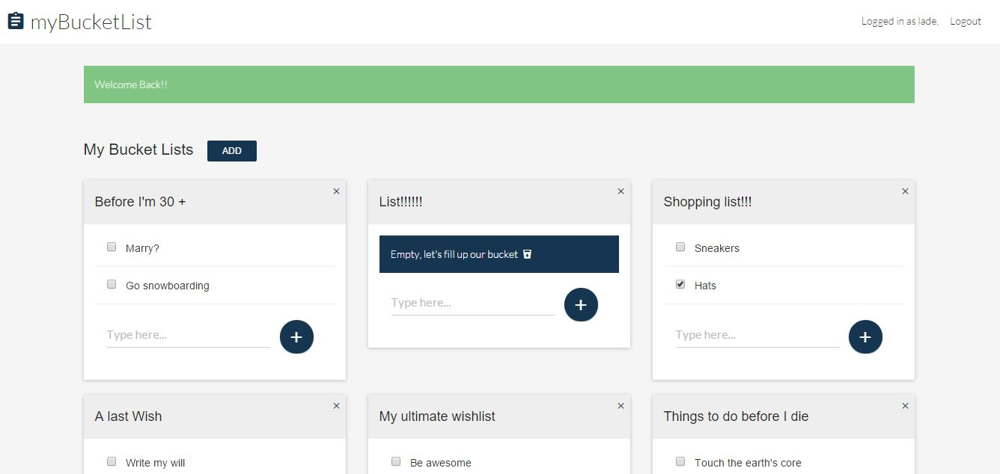

## Django Powered Bucketlist Application [](https://travis-ci.org/andela-ooshodi/django-bucketlist-application) [](https://coveralls.io/github/andela-ooshodi/django-bucketlist-application?branch=master)

### Challenge
Design a bucketlist APP with Django and PostgreSQL and it's API with django REST framework

### Description
The bucketlist app tagged **myBucketlist** is designed to be the simple solution for organizing everything you ever wish to do in life. 

It's simple design and friendly interactions makes it the app of choice to get you on your adventure as you mark off wishes from your wish list.

## Sample Screenshots




## Getting Started
## Structure of the project
This project is divided into two apps

1. bucketlist - which houses the complete standalone bucketlist app
2. apiv1 - version 1 of the api which exposes the bucketlist app

## Features
### Version 2
- Switched from bootstrap to bootstrap-material-design

## Installation
1. Clone the repository and create a Virtual Environment. 
- Run `virtualenv <virtualenvname>` or `mkvirtualenv <virtualenvname>` if using virtualenv wrapper to create the virtual environment.
2. Install all the necessary requirements by running `pip install -r requirements.txt` within the virtual environment.
3. Configure your database configurations in a development.py and save in the settings folder
4. Create a .env.yml to hold all your environment variables, like your secret key, save in the same level as your README.md file (sample shown below)
5. Run `bower install` to install all front end dependencies. Please ensure you are on the same level with .bowerrc when you run this command
6. Run `python manage.py collectstatic` to copy all your static files into the staticfiles directory
7. Run `python manage.py makemigrations` and `python manage.py migrate` to create the necessary tables and everything required to run the application.
7. Run `python manage.py runserver` to run the app.
8. Run coverage `coverage run manage.py test` to know how much the app is covered by automated testing.
9. View the report of the coverage on your terminal `coverage report`.
10. Produce the html of coverage result `coverage html`.

## Sample .env.yml format
```
SECRET_KEY:
  "sample_key"
```

## API Documentation
Django REST framework with swagger was used to document the API which can be viewed [here](http://mybucketlist-staging.herokuapp.com/docs/)


## myBucketlist
Need to see the app for yourself?
[myBucketlist](http://mybucketlist-staging.herokuapp.com)

